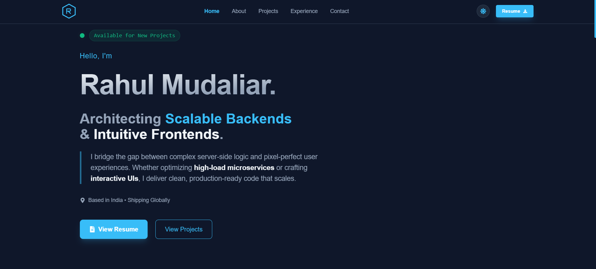

# Portfolio Website

A modern, high-performance portfolio website built with **React**, **Vite**, and **Tailwind CSS**. Designed for speed and SEO, it features a custom theme engine, lazy-loaded components, and a scalable architecture.

## Version 2 Updates (Jan 2026)

- **Architecture:** Rebuilt using a modular "Page" layout with code-splitting (`React.lazy`) for faster load times.
- **Theme Engine:** Fully dynamic Light/Dark mode using CSS variables and Tailwind.
- **Performance:** Added custom `useOnScreen` hook for scroll-based animations without external heavy libraries.
- **SEO:** Optimized metadata, Open Graph tags, and semantic HTML structure.

## Features

- ⚡ **Fast & Optimized:** Built with Vite for instant HMR and optimized production builds.
- 🎨 **Dynamic Theming:** Custom CSS variable-based Light/Dark mode with smooth transitions.
- 📱 **Responsive Design:** Mobile-first approach scaling perfectly to 4K screens.
- 🛠️ **Lazy Loading:** Critical path rendering with `Suspense` for heavy sections.
- 💼 **Experience Timeline:** Interactive timeline showcasing professional history.
- 📧 **Contact Form:** Integrated EmailJS with real-time validation and toast notifications.
- 🔗 **Smooth Navigation:** Scroll-based navigation with active state tracking.

## Demo

[**Live Demo**](https://rahul-mudaliar-portfolio.vercel.app)

## Screenshots

<table>
  <tr>
    <th width="50%">Version 1 (Legacy)</th>
    <th width="50%">Version 2 (Current - Jan 2026)</th>
  </tr>
  <tr>
    <td valign="top">
      
      <br/><br/>
    </td>
    <td valign="top">
      
    </td>
  </tr>
</table>

## Getting Started

### Prerequisites

- [Node.js](https://nodejs.org/) (v16+ recommended)
- [npm](https://www.npmjs.com/)

### Installation

1. **Clone the repository:**

   ```sh
   git clone [https://github.com/rahulpro1012/portfolio-website.git](https://github.com/rahulpro1012/portfolio-website.git)
   cd portfolio-website
   ```

   # Portfolio Website

   A modern, high-performance portfolio website built with **React**, **Vite**, and **Tailwind CSS**. Designed for speed and SEO, it features a custom theme engine, lazy-loaded components, and a scalable architecture.

   ## Project Structure

   ```text
   src/
   ├── components/    # UI Components
   │   ├── Home.jsx   # Hero Section (Eager Loaded)
   │   ├── Navbar.jsx # Fixed Navigation
   │   ├── Page.jsx   # Main Layout & Lazy Loading Logic
   │   ├── Projects.jsx # Projects Grid/Carousel
   │   └── ...        # Other sections (About, Experience, Email)
   ├── hooks/         # Custom Hooks
   │   └── useOnScreen.js # Intersection Observer for scroll animations
   ├── assets/        # Static local assets
   ├── main.jsx       # Application Entry Point
   ├── index.css      # Theme Variables & Tailwind Directives
   └── App.jsx        # Routing Configuration
   public/
   ├── logo.svg       # Browser Tab Icon
   └── preview-image.png # Social Media Share Image
   ```

   ## Configuration

   1. Theme Colors
      Theming is handled via CSS Variables in `src/index.css`. Change these values to update the color scheme globally:

   ```css
   :root {
     /* Light Mode */
     --color-primary: 248 250 252;
     --color-accent: 2 132 199;
   }
   .dark {
     /* Dark Mode */
     --color-primary: 15 23 42;
     --color-accent: 56 189 248;
   }
   ```

   2. EmailJS Setup
      To enable the contact form, create an account on EmailJS and update the credentials in `src/components/Email.jsx`:

   ```javascript
   emailjs.sendForm(
     "YOUR_SERVICE_ID",
     "YOUR_TEMPLATE_ID",
     form.current,
     "YOUR_PUBLIC_KEY"
   );
   ```

   3. SEO & Metadata
      Update the `<title>`, `<meta name="description">`, and `<meta name="keywords">` tags in `index.html` to match your profile.

   ## Dependencies

   - Core: React, Vite
   - Styling: Tailwind CSS, PostCSS
   - Routing: React Router DOM
   - Utilities: React Icons, React Toastify, EmailJS
   - Animations: CSS Keyframes & Intersection Observer API

   Made with ❤️ by Rahul Mudaliar
