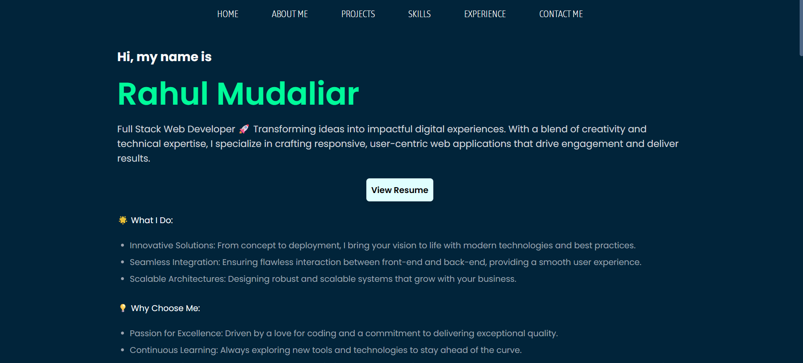
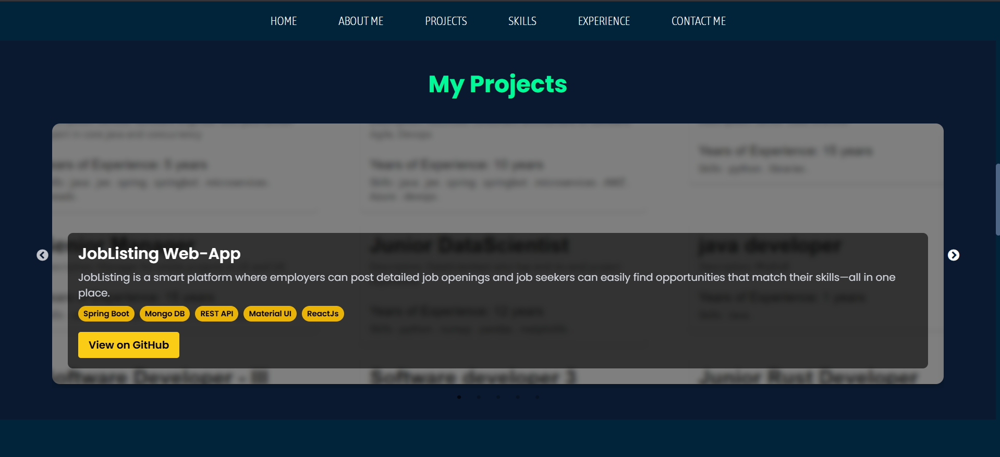

# Portfolio Website

A modern, responsive portfolio website built with **React**, **Vite**, and **Tailwind CSS**. Showcases your projects, skills, experience, and provides a contact form for collaboration opportunities.

## Features

- ⚡ Fast and optimized with Vite
- 🎨 Styled with Tailwind CSS and custom CSS
- 📱 Responsive design for all devices
- 🧑‍💻 Project carousel with details and GitHub links
- 🛠️ Skills section with animated progress bars
- 💼 Professional experience timeline
- 📧 Contact form powered by EmailJS
- 🔗 Smooth scrolling navigation

## Demo

[Live Demo](https://rahul-mudaliar-portfolio.vercel.app)

## Screenshots




## Getting Started

### Prerequisites

- [Node.js](https://nodejs.org/) (v16+ recommended)
- [npm](https://www.npmjs.com/) or [yarn](https://yarnpkg.com/)

### Installation

1. **Clone the repository:**

   ```sh
   git clone https://github.com/yourusername/portfolio-website.git
   cd portfolio-website
   ```

2. **Install dependencies:**

   ```sh
   npm install
   # or
   yarn install
   ```

3. **Start the development server:**

   ```sh
   npm run dev
   # or
   yarn dev
   ```

4. **Open your browser:**
   Visit [http://localhost:5173](http://localhost:5173) (or the port shown in your terminal).

### Build for Production

```sh
npm run build
# or
yarn build
```

### Preview Production Build

```sh
npm run preview
# or
yarn preview
```

## Project Structure

```
src/
  components/      # React components (Home, AboutMe, Projects, Skills, etc.)
  assets/          # Static assets
  App.jsx          # Main app component
  main.jsx         # Entry point
  App.css          # Custom styles
  index.css        # Tailwind base styles
public/
  images/          # Project and profile images
```

## Configuration

- **Tailwind CSS:** See [`tailwind.config.js`](tailwind.config.js)
- **Vite:** See [`vite.config.js`](vite.config.js)
- **EmailJS:** Update your service/template/user IDs in [`src/components/Email.jsx`](src/components/Email.jsx)

## Customization

- Update your personal info, skills, and experience in the respective components in [`src/components/`](src/components/)
- Add or replace images in [`public/images/`](public/images/)
- Change theme colors in [`src/App.css`](src/App.css) and Tailwind config

## Dependencies

- [React](https://react.dev/)
- [Vite](https://vitejs.dev/)
- [Tailwind CSS](https://tailwindcss.com/)
- [react-slick](https://react-slick.neostack.com/) (carousel)
- [react-scroll](https://www.npmjs.com/package/react-scroll) (smooth scrolling)
- [react-toastify](https://fkhadra.github.io/react-toastify/) (notifications)
- [EmailJS](https://www.emailjs.com/) (contact form)

---

Made with ❤️ by Rahul Mudaliar
